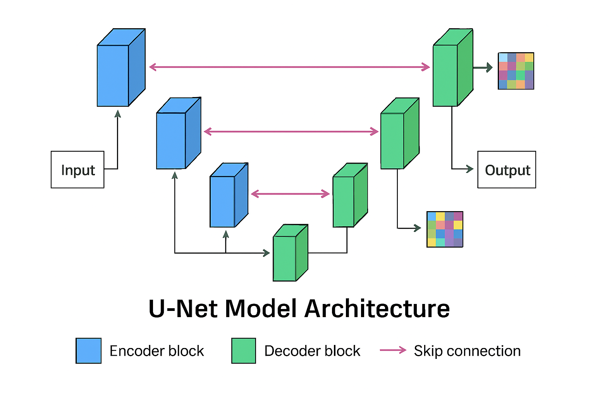
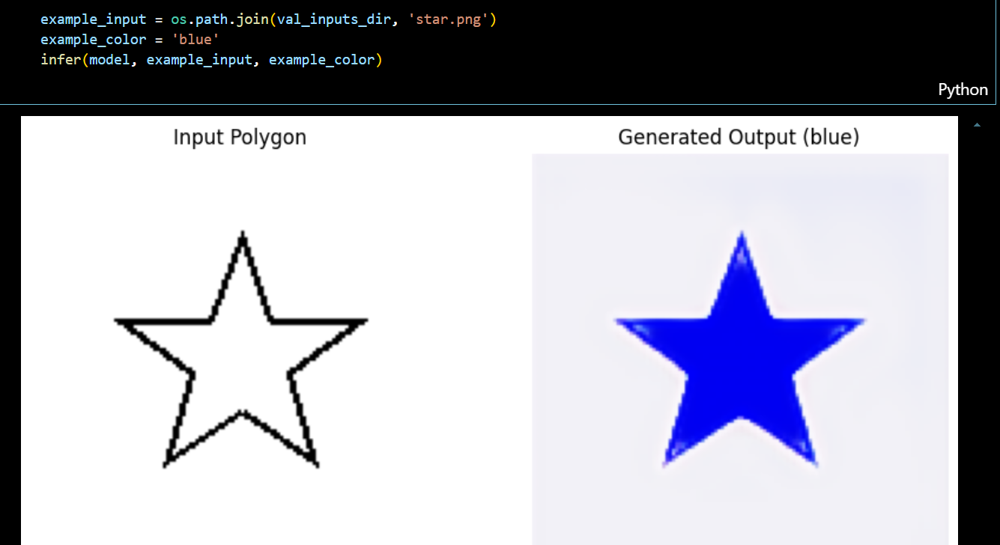

# Colored Polygon Generation with Conditional UNet

> **Author:** [Your Name]  
> **Wandb Project:** [Training and Experiment Logs](https://api.wandb.ai/links/gptc63926-bennett-university/tv7z94gq)

---

## 📝 Project Overview

This project addresses the task of **image-to-image translation**:  
Given an image of a polygon and a color name, **generate the corresponding filled polygon with that color** (e.g., blue triangle, red hexagon).

- **Input 1:** Polygon outline image (e.g., triangle, star)
- **Input 2:** Color name (e.g., 'red', 'blue')
- **Output:** Image of the same polygon filled with the specified color.

The core ML solution utilizes a **conditional UNet** implemented from scratch in PyTorch and trained using Weights & Biases experiment tracking.

---

## 📁 Dataset Structure

The dataset is structured as:

dataset/

training/

inputs/ # Grayscale polygon outlines

outputs/ # Colored polygons (targets)

data.json # Sample-to-file mapping and color name

validation/

...

- **Each entry** in `data.json` maps:
{
"input_polygon": "triangle.png",
"colour": "blue",
"output_image": "blue_triangle.png"
}

> **Note:** Dataset zip is not provided in this repo—download from [the official link](https://drive.google.com/open?id=1QXLgo3ZfQPorGwhYVmZUEWO_sU3i1pHM) and extract as described above.  
> See [data/README.md] for full setup instructions.

---

## 🚦 Solution Approach

### 1. Data Loading and Visualization

- **Custom PyTorch Dataset:** Loads polygon images, reads color (as one-hot vector), and returns normalized tensors.
- **Visualization:** See `notebooks/data_exploration.ipynb` for input/output samples and analysis.

### 2. Conditional UNet Model

- **UNet**: Encoder-decoder with skip connections.
- **Color Conditioning:** Color name (one-hot) is expanded spatially and concatenated with the input image channels.

> _UNet architecture diagram: The color code is injected as additional input channels. Encoder-decoder structure with skip connections enables fine details in output polygons._

### 3. Training

- **Loss function:** MSE (L2) loss on pixel values (could be L1/SSIM for further improvement).
- **Optimizer:** Adam.
- **Batch size:** 16 (can adjust as per compute).
- **Logged to wandb:** Train/val loss, output predictions, model configs.
- **Augmentation:** (Optional) Image rotations/scaling.

#### **Example wandb Visualization**
_(see full run and more output samples [here](https://api.wandb.ai/links/gptc63926-bennett-university/tv7z94gq))_:

| Input Polygon | Condition (Color) | Model Output |
| ------------- | ----------------- | ------------ |
|  | `blue` |  |

(More samples available in the repo and wandb project report.)

---

## 🛠️ Usage

Then, download the dataset as per the [instructions](data/README.md).

### **Train the Model**
Edit and run `src/train.py` to start training with wandb logging. All model architecture and config is in `main.ipynb` for full transparency.

### **Inference & Testing**
Use `notebooks/inference.ipynb` to:
- Load the trained model (see below)
- Input a polygon image and a color
- Generate and visualize the colored polygon

---

## ⚡ Model Weights Note

> **Model weights are NOT included in this repository**  
Due to size limitations, the final `.pth` file is **too large to be hosted on GitHub**.  
However, **the complete model definition and training/inference code** are available within `main.ipynb`—simply retrain on your own data split or checkpoint for evaluation.

---

## ❓ Key Insights & Learnings

**Hyperparameters**:
- LR: 0.001  
- Optimizer: Adam  
- Epochs: 50  
- Batch size: 16

**Architecture**:
- 4-level UNet with color channel conditioning.

**Training Dynamics**:
- Stable convergence observed in wandb.
- Occasional failures: Model can sometimes 'bleed' color into background for rare polygon shapes. This can be mitigated by stronger augmentations and/or larger UNet depth for more complex datasets.

**Key Takeaways**:
- Conditional UNet is robust for this per-pixel color generation task.
- One-hot color conditioning is simple and effective in this scenario.
- Visualization and frequent validation are critical for spotting failure modes.

---

## 💡 Acknowledgements

- [Weights & Biases](https://wandb.ai/) for logging and tracking experiments.
- Assignment provided by Ayna (ML Internship Test).

